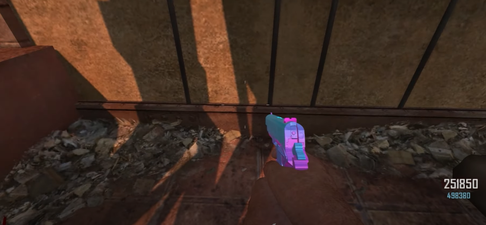
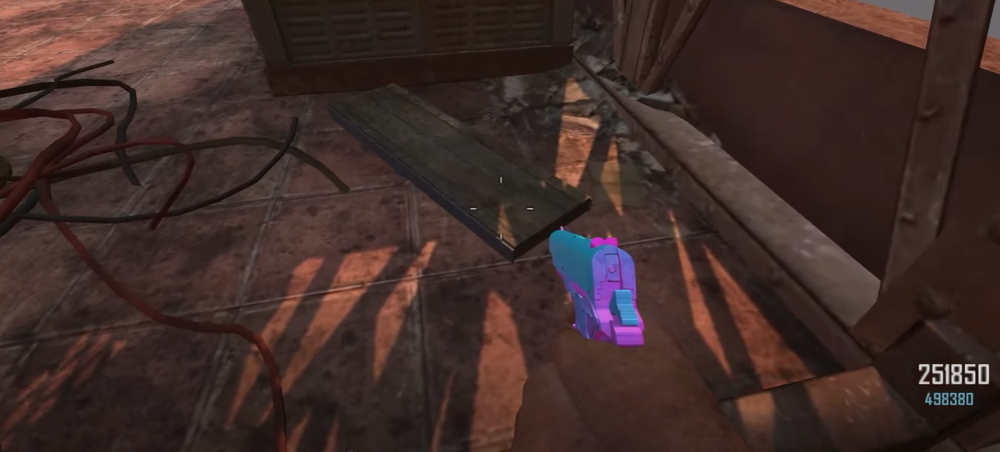
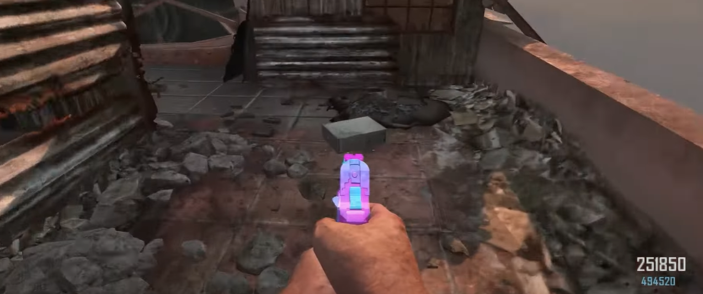
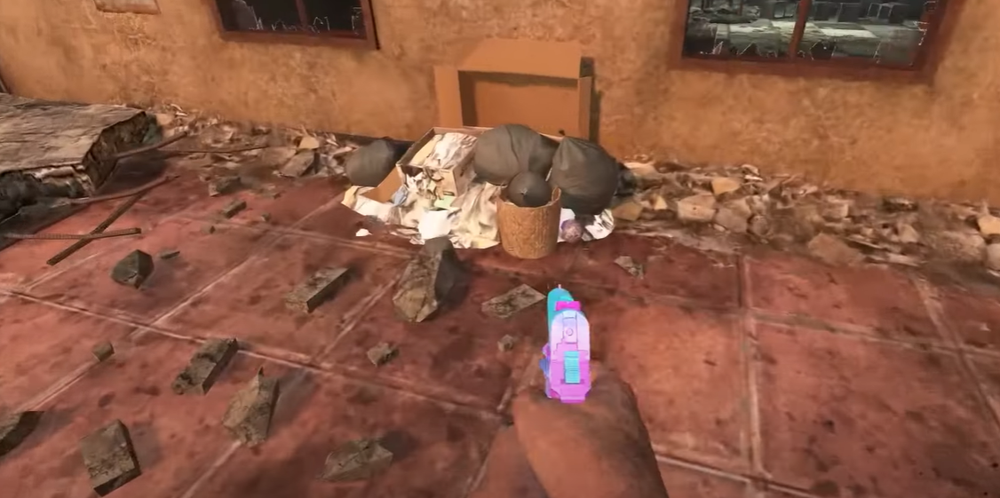
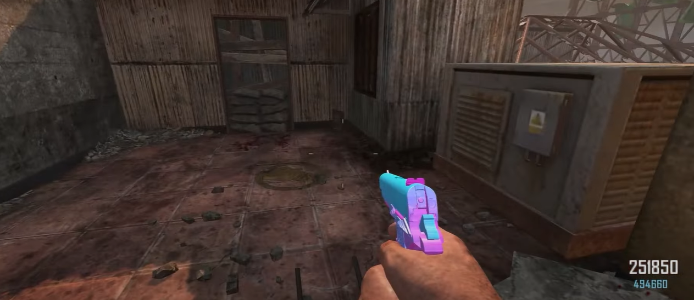
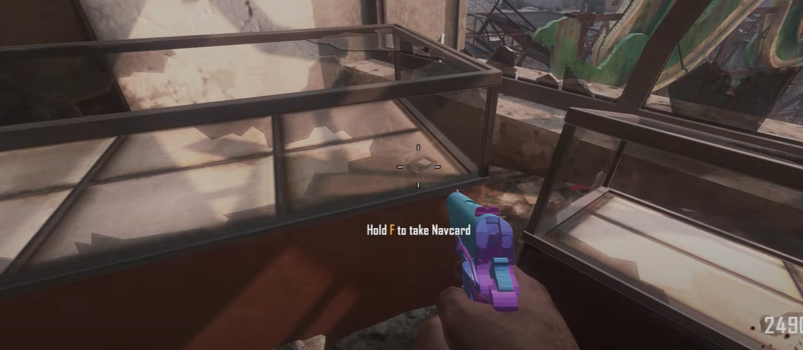

# Die Rise Navcard build guide
Need the Navcard from Tranzit. The Navcard on this map is to be scanned on Buried. Must be built below the railing under the pylon on the power building rooftop.\
\

# Part locations:
Right infront of the build location on the floor.\
\
\
Behind the staircase on the power building rooftop.\
\
\
In the pile of trash at the first dropdown after the pylon dropdown on the power building rooftop.\
\
\
In the corner of the second dropdown after the pylon dropdown.\

# Navcard location
In the display case in the PDW wallbuy room.\

