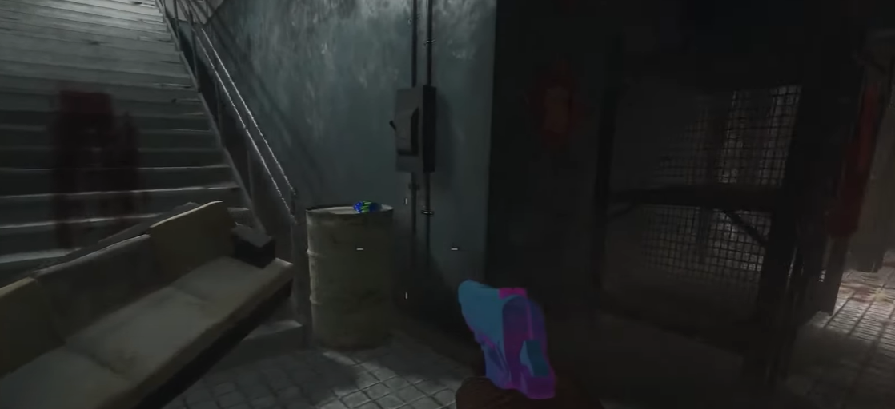

# Sliquifier Build Guide
Must be built at the table in the bottom of the power building.\
\

## Part 1 locations:
In the power building maze:\
\
\
On the barrel opposite the build table.\

## Part 2 location:
Directly above the build table up the stairs.\

## Part 3 locations:
In the cage right next to the build table.\
\
\
On the table right infront of the power switch.\

## Part 4 locations:
On the kitchen counter around the corner from the build table.\
\
\
On the table in the power room in front of the elevators.\

