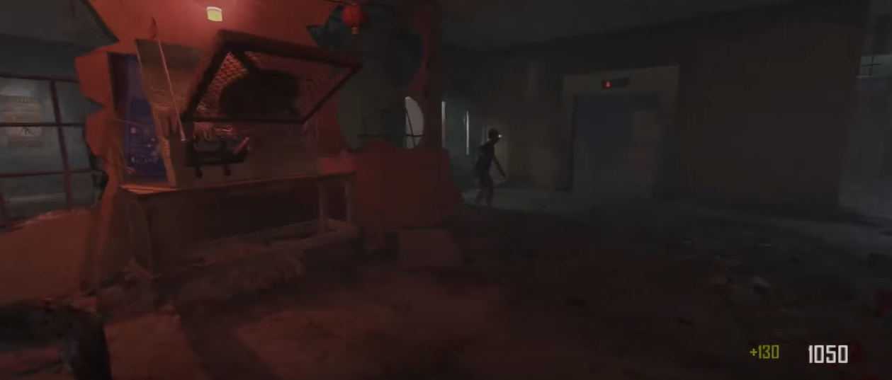
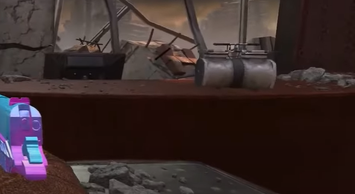
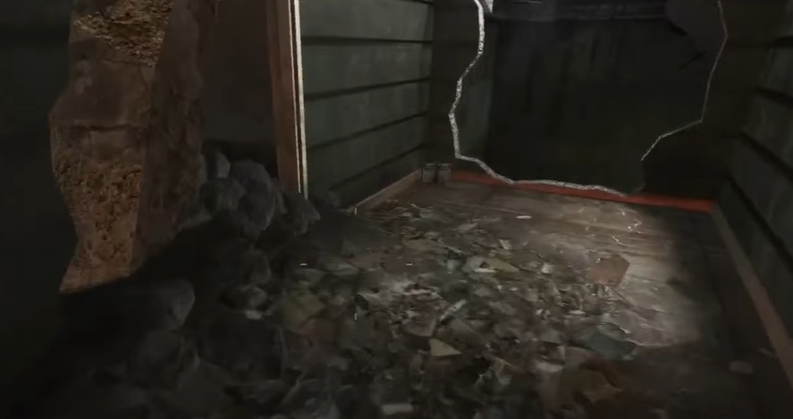
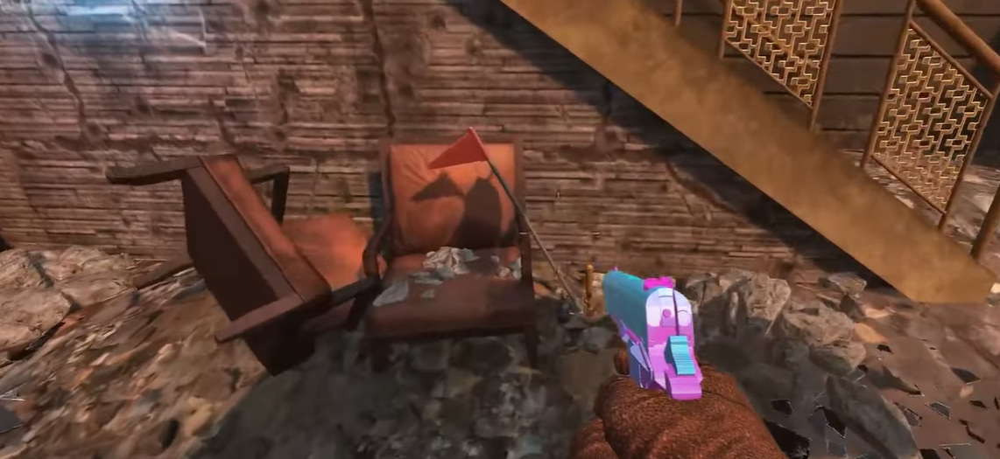
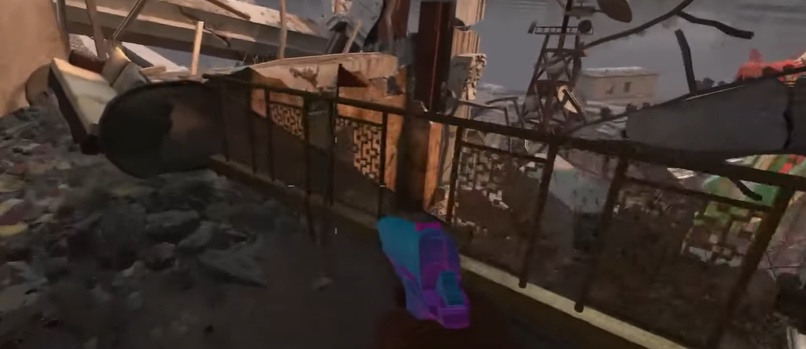
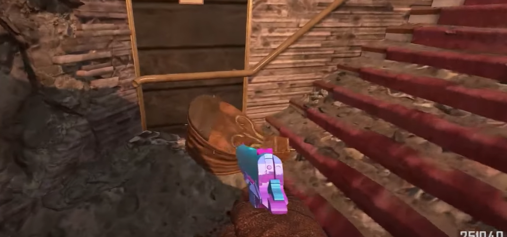
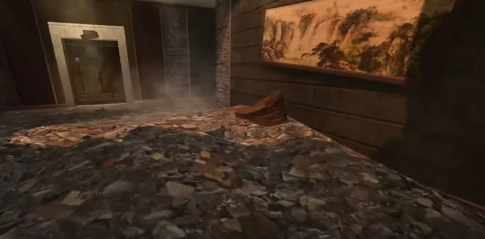
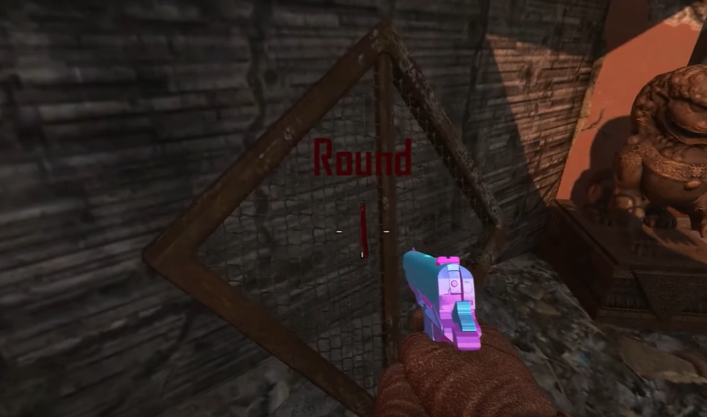
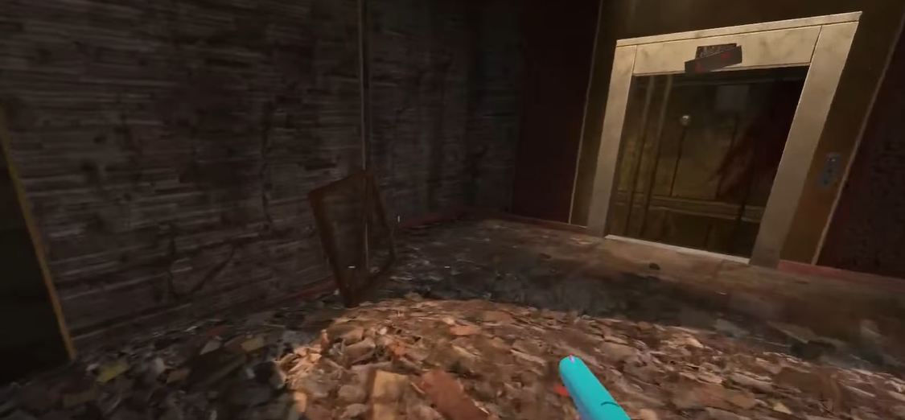

# Trample Steam Build Guide
Parts must be put into the buld table in the spawn building\
\

## Part 1 locations:
In spawn room on the desk.\
\
\
On the floor just before the broken stairs dropdown in the spawn building.\

## Part 2 locations:
Resting against these chairs in the spawn room:\
\
\
Resting against this railing at the top of the escalator in the spawn building:\

## Part 3 locations:
Halfway up the stairs in the spawn room.\
\
\
Out in the hallway just outside of the spawn room.\

## Part 4 locations:
Next to the lion statue in spawn.\
\
\
Out in the hallway just next to the spawn room.\

